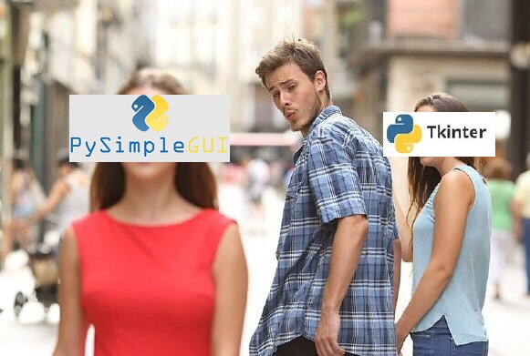
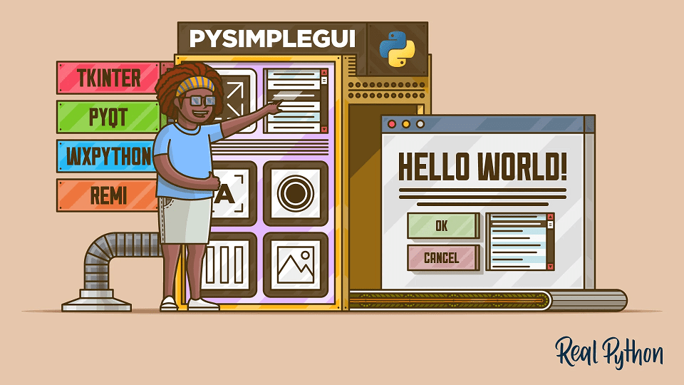
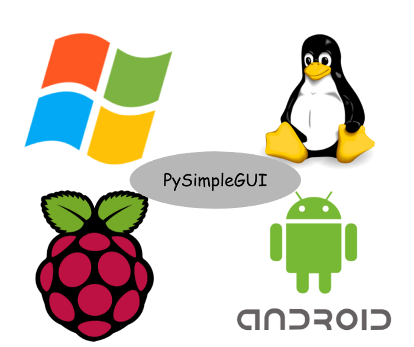

# Tkinter_vs_PySimpleGui

PySimpleGUI запущен в 2018 году. Сейчас 2022 год, активно разрабатывается и поддерживается.  
Тривиально создавайте приложения с графическим интерфейсом с помощью полного набора виджетов.

# Поддерживает tkinter, Qt, WxPython, Remi (в браузере).  

Многооконные приложения также просты. Поддерживаются версии от 3.4 до 3.11. Более 325 демонстрационных программ и кулинарная книга для быстрого старта. 
Обширная документация. Примеры для машинного обучения (интеграция OpenCV, Chatterbot), виджеты рабочего стола, подобные Rainmeter,
интеграция Matplotlib + Pyplot, добавление графического интерфейса в сценарии командной строки, PDF и средство просмотра изображений. 
Как для начинающих, так и для продвинутых программистов. 

PySimpleGUI использует вложенные списки Python для размещения своих элементов
Как видно из примеров кода, наша программа легче читается и стала существенно меньше по сравнению с неуклюжим tk 

PySimpleGUI.org GitHub — PySimpleGUI.com

